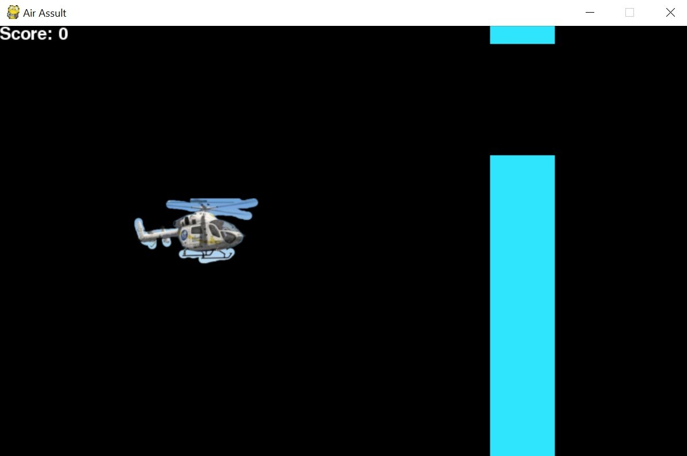
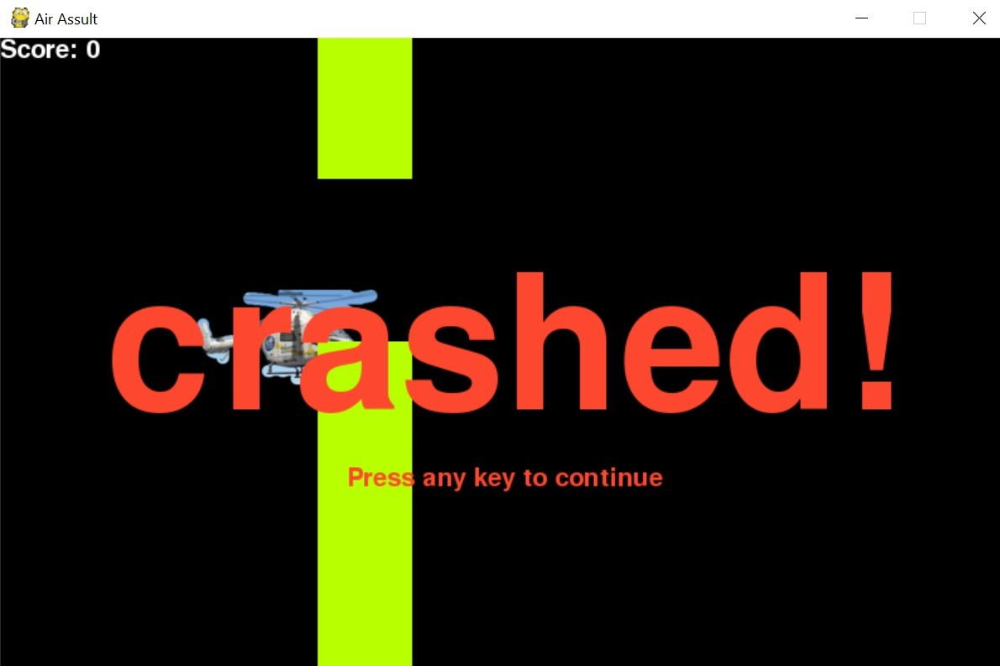

# 🚁 Air Assault Game


> A challenging and addictive arcade-style helicopter game where you navigate through obstacles and test your reflexes!

An engaging 2D helicopter game built with Pygame featuring dynamic difficulty progression, colorful obstacles, and smooth gameplay mechanics. Challenge yourself to achieve the highest score by avoiding obstacles while the game gets progressively harder!

---

## 📋 Overview

Air Assault is a classic arcade-style game where players control a helicopter navigating through increasingly difficult obstacles. The game features:

- **Real-time Gameplay** with smooth 60 FPS performance
- **Progressive Difficulty** that adapts to your skill level
- **Score Tracking** to measure your performance
- **Clean Modular Architecture** for easy maintenance and extension
- **Colorful Graphics** with randomized obstacle colors
- **Simple Controls** - just press UP arrow to fly!

---

## ✨ Features

### 🎮 Gameplay Mechanics

- **Intuitive Controls**: Single key (UP arrow) to control helicopter altitude
- **Gravity System**: Automatic downward movement with manual upward thrust
- **Dynamic Obstacles**: Randomly generated blocks with varying gaps
- **Progressive Difficulty**: Game speed and gap size adjust based on score
- **Real-time Score Display**: Track your performance during gameplay
- **Instant Restart**: Quick game-over screen with restart option

### 🏗️ Clean Architecture

- **Modular Design**: Separated concerns across multiple modules
- **Object-Oriented**: Clear class hierarchy for game entities
- **Type Hints**: Comprehensive type annotations for better code quality
- **Configurable**: Centralized configuration for easy customization
- **Documented**: Detailed docstrings for all classes and methods

### 🎨 Visual Elements

- **Colorful Blocks**: 5 vibrant color schemes that randomize
- **Smooth Animations**: 60 FPS gameplay for fluid motion
- **Clear UI**: Score display and game messages
- **Custom Graphics**: Helicopter sprite support

### ⚡ Performance

- **Optimized Rendering**: Efficient pygame draw calls
- **Frame Rate Control**: Consistent 60 FPS experience
- **Low Resource Usage**: Minimal CPU and memory footprint
- **Instant Response**: No input lag or delay

---

## 🚀 Quick Start

### Prerequisites

- **Python 3.8+** installed on your system
- **pip** package manager
- **Display** with minimum resolution 800x500

### Installation

1. **Clone the repository**

```bash
git clone https://github.com/pratyushsrivastava500/Air-Assault-Game.git
cd Air-Assault-Game
```

2. **Install dependencies**

```bash
pip install -r requirements.txt
```

3. **Run the game**

```bash
python main.py
```

4. **Start playing!**

- Press **UP arrow** to fly upward
- Release to descend
- Avoid the colored blocks
- Try to beat your high score!

---

## 🏗️ Architecture

The project follows a clean modular architecture:

```
┌─────────────────────────────────────┐
│         main.py (Entry Point)       │
│  • Game initialization              │
│  • Exception handling               │
└──────────────┬──────────────────────┘
               │
┌──────────────▼──────────────────────┐
│      GameEngine (game_engine.py)    │
│  • Main game loop                   │
│  • State management                 │
│  • Event handling                   │
└──────┬───────────────┬──────────────┘
       │               │
┌──────▼──────┐   ┌───▼──────────────┐
│  UI Module  │   │  Game Objects    │
│  (ui.py)    │   │ (game_objects.py)│
│  • Score    │   │  • Helicopter    │
│  • Messages │   │  • Block         │
└─────────────┘   └──────────────────┘
       │               │
┌──────▼───────────────▼──────────────┐
│   Configuration (config.py)         │
│  • Constants & colors               │
│  • Game settings                    │
│  • Difficulty levels                │
└─────────────────────────────────────┘
```

---

## 🛠️ Technology Stack

| Component | Technology | Purpose |
|-----------|-----------|---------|
| **Language** | Python 3.8+ | Core programming language |
| **Game Framework** | Pygame 2.5+ | Graphics, sound, and game loop |
| **Graphics** | 2D Sprites | Helicopter and visual elements |
| **Collision Detection** | AABB (Rectangle) | Precise collision checking |
| **Architecture** | OOP + Modular | Clean, maintainable code structure |

---

## 📁 Project Structure

```
Air-Assault-Game/
├── main.py                     # Main application entry point
├── requirements.txt            # Python dependencies
├── .gitignore                 # Git ignore patterns
├── README.md                  # This file
├── src/
│   ├── __init__.py           # Package initialization
│   ├── config.py             # Game configuration & constants
│   ├── game_engine.py        # Main game loop & logic
│   ├── game_objects.py       # Helicopter & Block classes
│   └── ui.py                 # UI rendering & messages
├── images/                    # Game images and screenshots
│   ├── images.png            # Helicopter sprite
│   ├── S1.jpg                # Screenshot 1
│   ├── S2.jpg                # Screenshot 2
│   └── S3.jpg                # Screenshot 3
├── notebooks/                 # Jupyter notebooks
│   └── Air Assult Game(Pratyush Srivastava).ipynb
└── docs/                      # Documentation
    └── Air Asssult Documentation(Pratyush Srivastava).pdf
```

---

## 📊 Game Mechanics

### Controls

| Key | Action |
|-----|--------|
| **UP Arrow** (Hold) | Fly upward |
| **UP Arrow** (Release) | Descend |
| **ESC / Close Window** | Quit game |

### Difficulty Progression

The game automatically adjusts difficulty based on your score:

| Score Range | Block Speed | Gap Size | Difficulty |
|-------------|-------------|----------|------------|
| 0-2 | 4 px/frame | 3.0x helicopter height | **Easy** |
| 3-4 | 5 px/frame | 2.9x helicopter height | **Medium** |
| 5-7 | 6 px/frame | 2.8x helicopter height | **Hard** |
| 8+ | 7 px/frame | 2.7x helicopter height | **Expert** |

### Scoring System

- **+1 point** for each obstacle successfully passed
- Score displayed in real-time at top-left corner
- Game over if helicopter hits:
  - Top or bottom screen boundary
  - Any colored obstacle block

---

## 📖 Usage Guide

### Starting the Game

1. Launch the game using `python main.py`
2. Game window opens automatically (800x500 resolution)
3. Helicopter appears on the left side
4. Obstacles start moving from right to left

### Playing the Game

1. **Control Altitude**: Press and hold UP arrow to ascend, release to descend
2. **Avoid Obstacles**: Navigate through the gaps between colored blocks
3. **Score Points**: Successfully pass obstacles to increase your score
4. **Watch Difficulty**: Game gets harder as your score increases

### Game Over

1. Collision displays "CRASHED!" message
2. Your final score is shown
3. Press any key to restart
4. Try to beat your previous score!

### Tips for High Scores

- **Timing is Everything**: Learn when to press and release the UP key
- **Stay Centered**: Avoid screen boundaries
- **Anticipate**: Look ahead to prepare for upcoming gaps
- **Practice**: Difficulty increases, so practice makes perfect
- **Smooth Movements**: Avoid rapid key presses for better control

---

## 🎯 Module Documentation

### config.py

Contains all game constants and configuration:

```python
# Display settings
SURFACE_WIDTH = 800
SURFACE_HEIGHT = 500

# Color definitions
BLACK = (0, 0, 0)
WHITE = (255, 255, 255)
# ... more colors

# Difficulty levels
DIFFICULTY_LEVELS = [...]
```

### game_objects.py

**Helicopter Class**:
- `move_up()`: Initiate upward movement
- `move_down()`: Initiate downward movement
- `update()`: Update position based on velocity
- `check_boundary_collision()`: Detect screen boundary hits

**Block Class**:
- `update()`: Move block leftward
- `reset()`: Generate new random obstacle
- `check_collision()`: Detect helicopter collision
- `set_speed()`: Adjust difficulty

### game_engine.py

**GameEngine Class**:
- `run()`: Main game loop
- `_handle_input()`: Process keyboard events
- `_update()`: Update game state
- `_render()`: Draw all game elements
- `_check_collisions()`: Collision detection

### ui.py

**UI Class**:
- `draw_score()`: Display current score
- `show_message()`: Display centered messages
- `show_game_over()`: Game over screen

---

## 🔧 Customization

### Modify Game Settings

Edit `src/config.py` to customize:

```python
# Change window size
SURFACE_WIDTH = 1024
SURFACE_HEIGHT = 768

# Adjust helicopter speed
HELICOPTER_SPEED = 7

# Modify difficulty
DIFFICULTY_LEVELS = [
    {"min_score": 0, "max_score": 10, "speed": 3, "gap_multiplier": 3.5},
    # Add more levels...
]

# Change colors
COLOR_CHOICES = [YOUR_COLORS_HERE]
```

### Add New Features

The modular architecture makes it easy to add:

- **Sound Effects**: Add to `game_engine.py`
- **Power-ups**: Create new class in `game_objects.py`
- **Multiple Lives**: Modify game state in `game_engine.py`
- **High Score Tracking**: Add to `ui.py` with file I/O
- **Different Obstacles**: Extend `Block` class

---

## 🤖 Code Quality

### Architecture Benefits

- **Separation of Concerns**: Each module has a single responsibility
- **Testability**: Easy to unit test individual components
- **Maintainability**: Clear structure for bug fixes and updates
- **Extensibility**: Simple to add new features
- **Readability**: Well-documented and organized code

### Type Safety

All functions include type hints:

```python
def check_collision(self, helicopter: Helicopter) -> bool:
    """Check collision with type-safe parameters."""
    pass
```

---

## 🔮 Future Enhancements

- [ ] **Sound Effects** - Add collision, score, and background music
- [ ] **High Score System** - Persistent leaderboard with JSON storage
- [ ] **Power-ups** - Shield, speed boost, or slow-motion pickups
- [ ] **Multiple Levels** - Different backgrounds and obstacle types
- [ ] **Multiplayer Mode** - Split-screen or turn-based gameplay
- [ ] **Mobile Support** - Touch controls for mobile devices
- [ ] **Particle Effects** - Explosions and trail effects
- [ ] **Settings Menu** - Volume, difficulty, and control customization
- [ ] **Achievements** - Unlockable rewards and milestones
- [ ] **Theme Customization** - Day/night modes and skins

---

## 🐛 Troubleshooting

### Issue: Pygame not installed

```bash
# Solution
pip install pygame>=2.5.0
```

### Issue: Image not found error

```bash
# Ensure images.png is in the root directory
ls images.png  # Linux/Mac
dir images.png  # Windows
```

### Issue: Game runs too fast/slow

```python
# Edit FPS in src/config.py
FPS = 60  # Adjust this value
```

### Issue: Window doesn't open

```bash
# Check display settings
# Ensure minimum 800x500 resolution available
# Try windowed mode if fullscreen fails
```

### Issue: Import errors

```bash
# Ensure you're running from project root
cd Air-Assault-Game
python main.py
```

---

## 🤝 Contributing

Contributions are welcome! Please follow these guidelines:

1. **Fork the repository**
2. **Create a feature branch** (`git checkout -b feature/AmazingFeature`)
3. **Commit your changes** (`git commit -m 'Add AmazingFeature'`)
4. **Push to the branch** (`git push origin feature/AmazingFeature`)
5. **Open a Pull Request**

### Coding Standards

- Follow **PEP 8** style guide
- Add **type hints** to all functions
- Write **comprehensive docstrings**
- Include **unit tests** for new features
- Update **documentation** as needed
- Keep **commits atomic** and well-described

---

## 📝 License

This project is licensed under the MIT License.

```
MIT License

Copyright (c) 2025 Pratyush Srivastava

Permission is hereby granted, free of charge, to any person obtaining a copy
of this software and associated documentation files (the "Software"), to deal
in the Software without restriction, including without limitation the rights
to use, copy, modify, merge, publish, distribute, sublicense, and/or sell
copies of the Software, and to permit persons to whom the Software is
furnished to do so, subject to the following conditions:

The above copyright notice and this permission notice shall be included in all
copies or substantial portions of the Software.

THE SOFTWARE IS PROVIDED "AS IS", WITHOUT WARRANTY OF ANY KIND, EXPRESS OR
IMPLIED, INCLUDING BUT NOT LIMITED TO THE WARRANTIES OF MERCHANTABILITY,
FITNESS FOR A PARTICULAR PURPOSE AND NONINFRINGEMENT.
```

---

## 🎓 About Python & Pygame

### Why Python?

- **Easy to Learn**: Simple syntax similar to English
- **Powerful**: Capable of handling complex game logic
- **Cross-Platform**: Runs on Windows, Mac, Linux
- **Rich Ecosystem**: Extensive libraries for game development
- **Fast Prototyping**: Quick development and iteration

### About Pygame

Pygame is a cross-platform set of Python modules designed for writing video games. It provides:

- Computer graphics and sound libraries
- Game loop and event handling
- Sprite management and collision detection
- Built on top of the SDL library
- Active community and extensive documentation

### Installing Pygame

```bash
# Using pip (recommended)
pip install pygame

# Verify installation
python -c "import pygame; print(pygame.version.ver)"
```

---

## 📸 Screenshots

### Game Start

*The game begins with the helicopter on the left side*

### Active Gameplay

*Navigate through colorful obstacles and score points*

### Increasing Difficulty

*Gaps get smaller and blocks move faster as you progress*

---

## 🙏 Acknowledgments

- **Pygame Community** for the excellent game development framework
- **Python Software Foundation** for the Python language
- **Open Source Contributors** for inspiration and best practices
- **Game Development Community** for tutorials and resources
- **Players** who provide feedback and suggestions

---

## 📧 Contact

For questions, suggestions, or support:

**Author**: Pratyush Srivastava  
**Email**: [pratyushsrivastava500@gmail.com](mailto:pratyushsrivastava500@gmail.com)  
**GitHub**: [@pratyushsrivastava500](https://github.com/pratyushsrivastava500)  
**Project Repository**: [Air-Assault-Game](https://github.com/pratyushsrivastava500/Air-Assault-Game)

Feel free to open an issue on GitHub for bug reports or feature requests!

---

## 📚 Additional Resources

- [Pygame Documentation](https://www.pygame.org/docs/)
- [Python Official Docs](https://docs.python.org/3/)
- [Game Development Patterns](https://gameprogrammingpatterns.com/)
- [Python Game Development Tutorials](https://realpython.com/tutorials/gamedev/)

---

## ⭐ Support

If you find this project helpful or entertaining:

- ⭐ **Star** this repository
- 🐛 **Report bugs** via GitHub issues
- 💡 **Suggest features** in discussions
- 🔀 **Fork** and create your own version
- 📢 **Share** with friends who love gaming

---

<div align="center">

**Made with ❤️ and Python | © 2025 Pratyush Srivastava**

*Keep flying, keep scoring!* 🚁

[⬆ Back to Top](#-air-assault-game)

</div>
Reserved Prepared By Pratyush Srivastava

